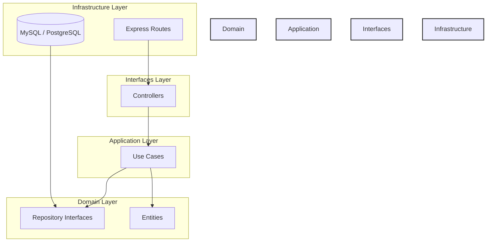
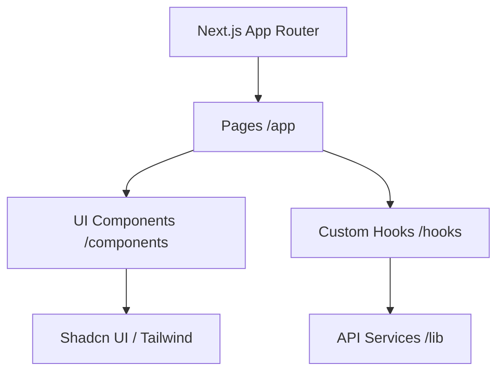
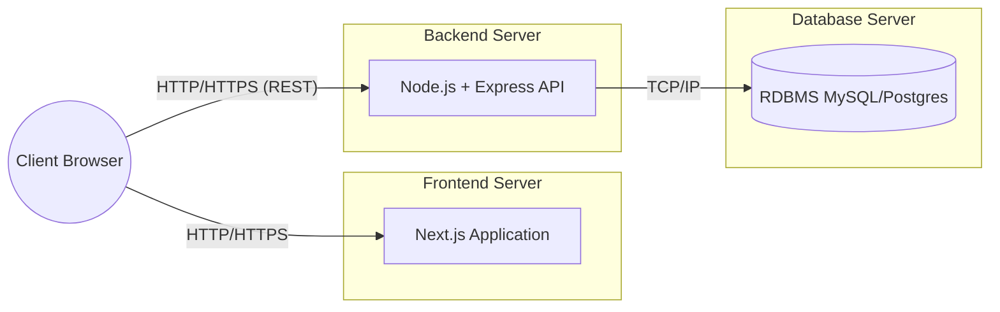

# Vistas Arquitectónicas y Puntos de Vista

Para gestionar la complejidad, la arquitectura del sistema se describe utilizando diferentes vistas que se dirigen a distintas preocupaciones de los stakeholders.

## 1. Vista Lógica (Backend Clean Architecture)
Muestra la organización del código backend en capas concéntricas, donde las dependencias siempre apuntan hacia el interior.

*Descripción:* Las capas externas (Infraestructura, Interfaces) dependen de las capas internas (Aplicación, Dominio). El Dominio no tiene dependencias de ninguna otra capa.

## 2. Vista de Desarrollo (Frontend Component Architecture)
Muestra la jerarquía y organización de los componentes del frontend en Next.js.

## 3. Vista de Despliegue (Deployment View)
Representa cómo el software se mapea teóricamente en la infraestructura de hardware/nube.

*Nota:* En una aplicación de página única (SPA) servida estáticamente, el cliente podría comunicarse directamente con el Backend Server después de cargar la UI desde el Frontend Server.