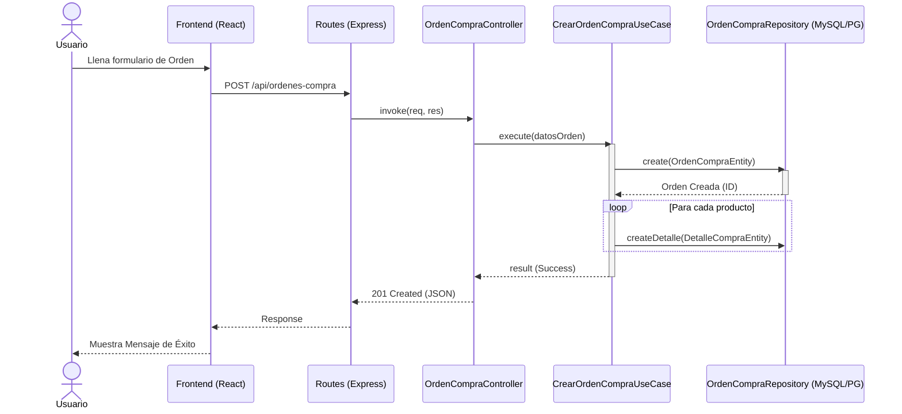
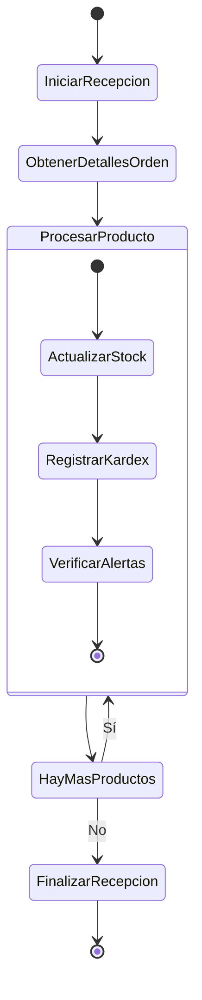

# Diseño de Comportamiento (Modelos de Comportamiento)

Este documento ilustra la dinámica y el flujo de control del sistema para los procesos más críticos.

## 1. Diagrama de Secuencia: Creación de Orden de Compra

El siguiente diagrama muestra el flujo típico cuando el usuario (desde el Frontend) interactúa con el sistema para crear una Orden de Compra. Este flujo atraviesa todas las capas de la "Clean Architecture" en el Backend.

## 2. Diagrama de Actividad: Actualización de Inventario (Kardex)

El siguiente diagrama de actividad describe la lógica de negocio cuando se aprueba o recepciona una orden, lo que afecta el inventario de un producto.

