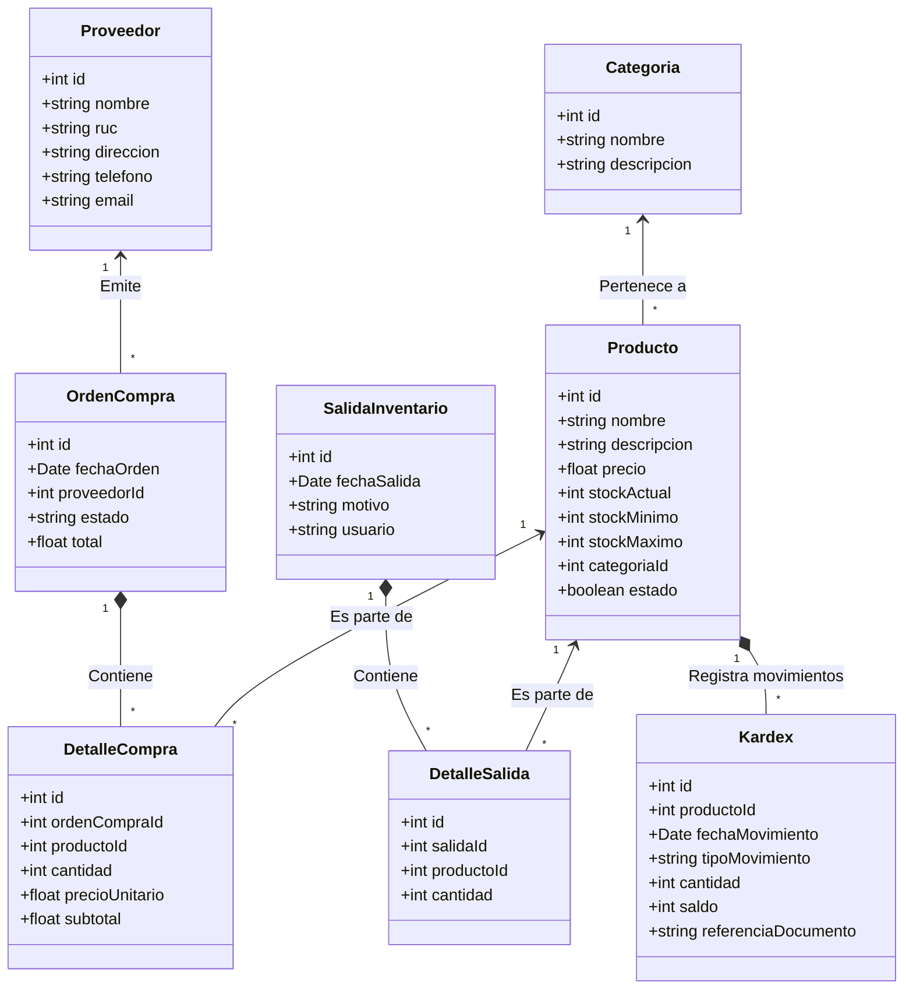

# Diseño Estructural (Modelos Estructurales)

Este documento describe la estructura estática del sistema mediante diagramas de clases, enfocándose en las entidades principales del Dominio.

## Diagrama de Clases del Dominio

El siguiente diagrama representa las entidades fundamentales inferidas a partir del código fuente y las relaciones entre ellas.

*Descripción de Entidades Principales:*
- **Producto:** Centro del sistema de inventario. Está vinculado a Categorías y es referenciado en órdenes de compra, salidas y kardex.
- **Kardex:** Entidad fundamental para el seguimiento del histórico de entradas y salidas de un producto específico, manteniendo el saldo actualizado.
- **OrdenCompra y DetalleCompra:** Representan el flujo de ingreso de mercancía desde los proveedores.
- **SalidaInventario y DetalleSalida:** Representan el flujo de salida de mercancía (ej. ventas o mermas).