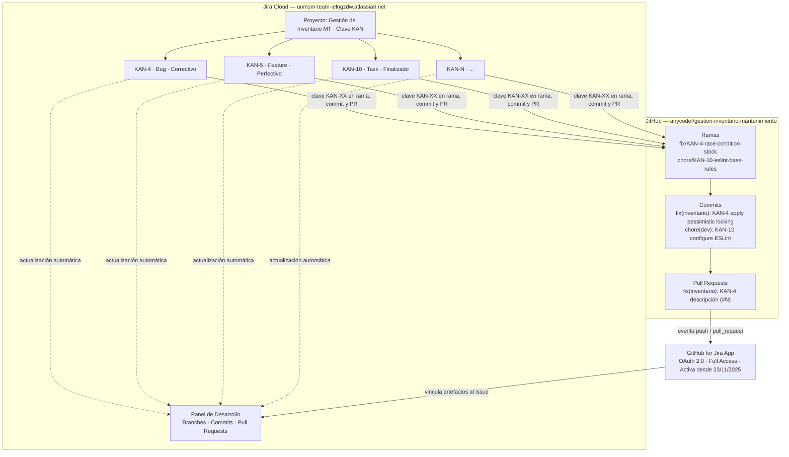

# Guía de Integración Jira–GitHub

**Proyecto:** Gestión de Inventario MT  
**Clave Jira:** KAN  
**Clasificación:** Documentación de Gestión de Configuración — ISO/IEC 12207  
**Repositorio:** anycodef/gestion-inventario-mantenimiento  
**Fecha de elaboración:** 2026-05-23

---

## 1. Propósito y Contexto ISO/IEC 12207

Este documento constituye evidencia formal del proceso de **Gestión de la Configuración del Software** (cláusula 6.3.5 de ISO/IEC 12207:2017) para el proyecto de mantenimiento del Sistema de Gestión de Inventario. Describe la integración activa entre el sistema de seguimiento de incidencias (Jira) y el sistema de control de versiones (GitHub), garantizando la trazabilidad bidireccional requerida entre los elementos de configuración y los ítems de trabajo.

La integración cumple los siguientes objetivos del proceso de gestión de configuración:

- **Identificación de la configuración:** cada cambio al código está vinculado a un ítem de trabajo Jira que lo origina.
- **Control de la configuración:** los cambios son aprobados y registrados antes de su integración al trunk.
- **Registro del estado de la configuración:** el estado de cada cambio es trazable desde Jira hasta el commit o PR correspondiente.
- **Auditoría de la configuración:** la integración permite verificar que todo cambio en el repositorio responde a un ítem de trabajo autorizado.

---

## 2. Arquitectura de la Integración



---

## 3. Configuración de la Integración

### 3.1 Aplicación instalada

| Parámetro | Valor |
|---|---|
| Aplicación | GitHub for Jira (Atlassian Marketplace) |
| Instancia Jira | `unmsm-team-ielngzdw.atlassian.net` |
| Organización/Repositorio GitHub | `anycodef/gestion-inventario-mantenimiento` |
| Nivel de acceso | Full Access |
| Estado | Activa |
| Fecha de activación | 23/11/2025 |
| Mecanismo de autenticación | OAuth 2.0 |

### 3.2 Permisos otorgados a la aplicación

| Permiso | Alcance |
|---|---|
| Repositorios | Lectura de metadatos, ramas, commits y PRs |
| Issues | Lectura y escritura (para transiciones via Smart Commits) |
| Pull Requests | Lectura de títulos, estado y revisiones |
| Webhooks | Recepción de eventos push y pull_request |

### 3.3 Proyecto Jira vinculado

| Parámetro | Valor |
|---|---|
| Nombre del proyecto | Gestión de Inventario MT |
| Clave | `KAN` |
| Tipo | Scrum / Kanban |
| Metodología de mantenimiento | Trunk-Based Development |

---

## 4. Mecanismo de Vinculación

La integración detecta automáticamente la clave Jira (`KAN-XX`) cuando aparece en:

1. **Nombre de la rama**
2. **Mensaje del commit** (subject line)
3. **Título del Pull Request**

No se requiere configuración adicional por parte del desarrollador: la aplicación GitHub for Jira escanea estos campos en cada evento de push o PR y crea el vínculo en el panel de desarrollo del ticket.

### 4.1 Formato de rama

```
<tipo>/KAN-<número>-<descripcion-corta>
```

**Ejemplos confirmados:**

```bash
fix/KAN-4-race-condition-stock-on-order-approval
chore/KAN-10-eslint-base-rules
feat/KAN-5-descripcion-feature
```

### 4.2 Formato de commit (Conventional Commits + Jira)

```
<tipo>(<scope>): KAN-<número> <descripción imperativa>
```

**Commits confirmados y vinculados:**

```bash
# KAN-4 — Bug correctivo: condición de carrera en stock
fix(inventario): KAN-4 add actualizarStock method to product repository layer
fix(inventario): KAN-4 implement ActualizarStockProductoUseCase
fix(inventario): KAN-4 apply pessimistic locking on stock update when order is completed

# KAN-10 — Task: configuración de ESLint
chore(dev): KAN-10 configure ESLint with project base rules
```

### 4.3 Formato de Pull Request

```
<tipo>(<scope>): KAN-<número> <descripción> (#<PR-number>)
```

**Ejemplo:**

```
fix(inventario): KAN-4 fix race condition on concurrent stock update (#3)
```

### 4.4 Smart Commits (transiciones automáticas en Jira)

Los Smart Commits permiten transicionar tickets y registrar tiempo directamente desde el cuerpo del commit:

```bash
git commit -m "fix(inventario): KAN-4 apply pessimistic locking on stock update

Descripción del cambio...

KAN-4 #comment Race condition corregida con locking pesimista en MySQL y PostgreSQL
KAN-4 #time 3h
KAN-4 #done"
```

| Comando Smart Commit | Efecto en Jira |
|---|---|
| `KAN-XX #comment <texto>` | Agrega comentario al ticket |
| `KAN-XX #time Xh Ym` | Registra tiempo trabajado |
| `KAN-XX #done` | Transiciona el ticket a "Done" |
| `KAN-XX #in-progress` | Transiciona el ticket a "In Progress" |

---

## 5. Tabla de Trazabilidad — Issues KAN

La siguiente tabla registra los ítems de trabajo actuales del proyecto con su clasificación de mantenimiento (ISO/IEC 14764), estado y commits o ramas vinculados.

| Issue | Título | Tipo | Clasificación ISO 14764 | Estado | Rama | Commits vinculados |
|---|---|---|---|---|---|---|
| KAN-4 | Error de cálculo de stock disponible al procesar compras concurrentes | Bug | Correctivo | En revisión | `fix/KAN-4-race-condition-stock-on-order-approval` | `6185bae`, `dc02136`, `a1595c7` |
| KAN-5 | — | Feature | Perfectivo | Pendiente | — | — |
| KAN-6 | — | Task | Adaptativo | Pendiente | — | — |
| KAN-7 | — | Task | Preventivo | Pendiente | — | — |
| KAN-8 | — | Task | — | Pendiente | — | — |
| KAN-9 | — | Task | — | Pendiente | — | — |
| KAN-10 | Configurar ESLint con reglas base del proyecto | Task | Perfectivo | Finalizado | `fix/KAN-10-eslint` | `cf31367` |

> Los campos marcados con `—` corresponden a ítems cuyo detalle no ha sido trasladado al repositorio en el momento de elaboración de este documento. Deben completarse conforme se avance en el sprint.

---

## 6. Flujo de Trabajo — Del Issue al Merge

El siguiente flujo describe el ciclo completo de un ítem de trabajo desde su creación en Jira hasta su integración en `main`, siguiendo el modelo Trunk-Based Development adoptado por el equipo.

```
1. CREACIÓN DEL ISSUE EN JIRA
   ─────────────────────────────
   · El equipo crea o recibe el issue en el proyecto KAN.
   · Se asigna tipo (Bug / Task / Feature), clasificación ISO 14764
     y responsable.
   · El issue queda en estado "To Do".

2. INICIO DEL TRABAJO
   ─────────────────────────────
   · El desarrollador crea una rama desde main:

     git checkout main && git pull origin main
     git checkout -b fix/KAN-4-descripcion-corta

   · El issue transiciona automáticamente a "In Progress"
     al detectarse la rama con la clave KAN-4.
   · Opcionalmente, via Smart Commit:
     KAN-4 #in-progress

3. DESARROLLO Y COMMITS ATÓMICOS
   ─────────────────────────────
   · Cada commit resuelve una unidad lógica de cambio.
   · El subject sigue Conventional Commits con clave Jira:

     fix(scope): KAN-4 descripción del cambio

   · Jira vincula el commit al issue automáticamente.
   · Los commits se pueden ver en el panel de desarrollo
     del ticket en tiempo real.

4. APERTURA DE PULL REQUEST
   ─────────────────────────────
   · La rama se sube al remoto:

     git push origin fix/KAN-4-descripcion-corta

   · Se abre el PR en GitHub con título:

     fix(scope): KAN-4 descripción (#N)

   · El PR aparece vinculado en el panel de desarrollo de Jira.
   · El issue transiciona a "In Review".

5. CODE REVIEW
   ─────────────────────────────
   · Al menos 1 aprobación requerida.
   · Los pipelines de CI (lint, build) deben pasar.
   · El revisor verifica que la solución corresponde
     al alcance definido en el issue Jira.

6. MERGE Y CIERRE
   ─────────────────────────────
   · Se hace merge a main (Squash & Merge o Rebase & Merge).
   · Se elimina la rama feature.
   · El issue transiciona a "Done" mediante Smart Commit
     o manualmente en Jira:

     KAN-4 #done

   · El panel de desarrollo del issue refleja:
     - Rama: merged
     - Commits: vinculados
     - PR: merged
```

---

## 7. Convenciones del Equipo

### 7.1 Reglas obligatorias

- Toda rama de trabajo **debe incluir la clave KAN-XX** en su nombre. Las ramas sin clave no serán aprobadas en code review.
- Todo commit que resuelva o avance un ítem de trabajo **debe incluir la clave en el subject** del mensaje.
- No se realizan commits directos a `main`. Todo cambio entra vía Pull Request.
- La rama se elimina del remoto inmediatamente después del merge.

### 7.2 Reglas recomendadas

- Usar Smart Commits para registrar tiempo (`#time`) y transicionar tickets (`#done`) desde el propio mensaje de commit, manteniendo Jira actualizado sin intervención manual adicional.
- El título del Pull Request debe replicar el formato del commit principal: `tipo(scope): KAN-XX descripción`.
- Las ramas deben vivir máximo 1–3 días (principio TBD). Si el trabajo se extiende, dividirlo en sub-issues más pequeños.

### 7.3 Referencias a la documentación de convenciones

| Documento | Ubicación |
|---|---|
| Estrategia de ramas (TBD) | [`docs/branching-strategy.md`](branching-strategy.md) |
| Convenciones de commits | [`docs/commit-conventions.md`](commit-conventions.md) |
| Protocolo de control de cambios | [`docs/05_Configuration_Management/02_protocolo_control_cambios.md`](05_Configuration_Management/02_protocolo_control_cambios.md) |
| Estrategia de versionamiento | [`docs/05_Configuration_Management/01_estrategia_versionamiento.md`](05_Configuration_Management/01_estrategia_versionamiento.md) |
